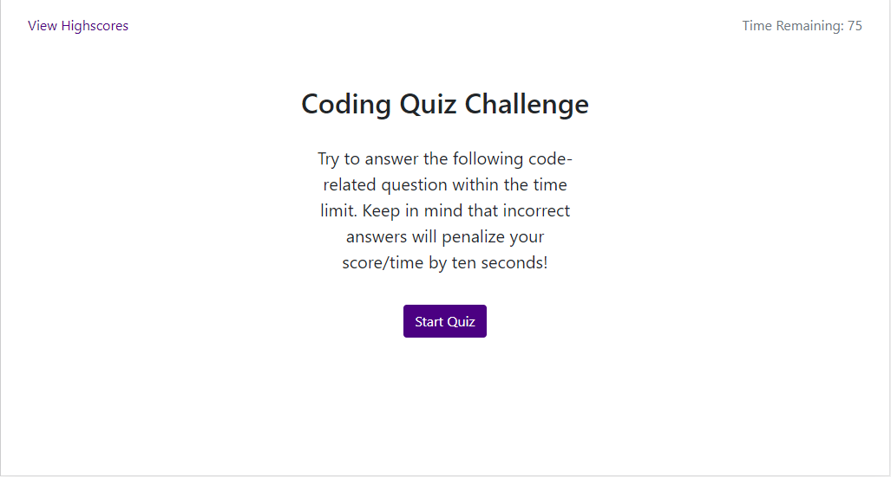
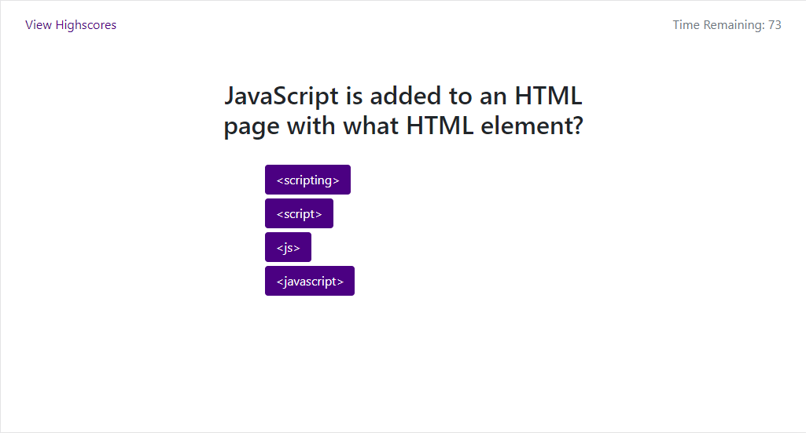
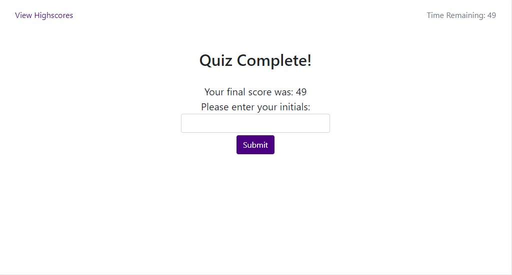
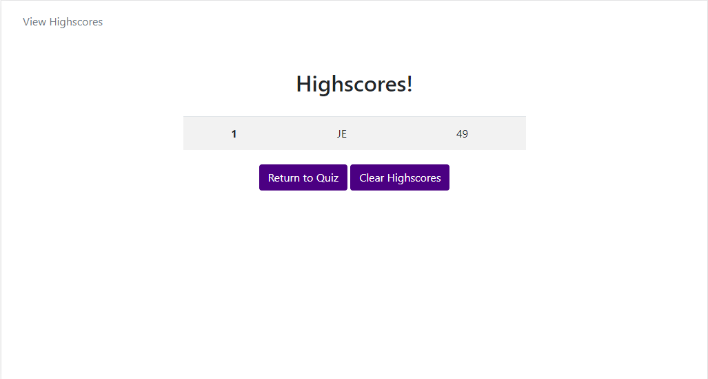

# JavaScript Web Quiz
This webquiz uses DOM navigation to populate question and mutiple-choice answer fields related to JavaScript. The quiz is timed using a JavaScript interval, and incorrect answers penalize the quiz-taker by 10 seconds. In this version highscores are recorded in localStorage memory.

# Start Page

# Quiz Page 1

# Record Highscores

# Highscores

[https://jodoedjr.github.io/WebQuiz/](https://jodoedjr.github.io/WebQuiz/)